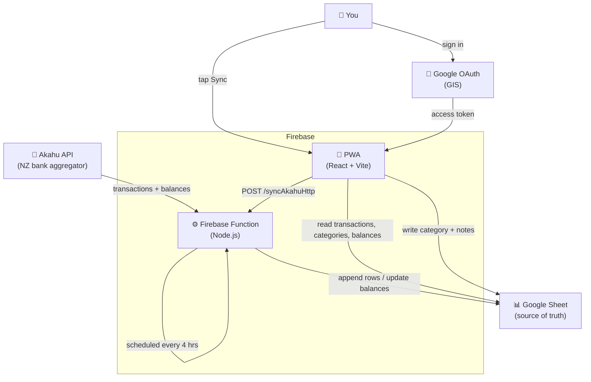

# Budget App

A personal budget app for tracking and categorising NZ bank transactions. Bank data is synced from [Akahu](https://akahu.nz) into a Google Sheet, which acts as the database. A PWA provides a mobile-friendly UI for viewing and categorising transactions.

## Architecture



### Data flow

| Path | How |
|---|---|
| Scheduled sync | Cloud Scheduler triggers `syncAkahu` every 4 hours |
| Manual sync | "Sync" button in the PWA calls `syncAkahuHttp` (auth'd with `SYNC_SECRET`) |
| Read data | PWA calls Google Sheets API v4 directly using the user's OAuth token |
| Write category | PWA writes back to the `transactions` sheet in-place |

## Sheets structure

### `transactions`
| `id` | `date` | `description` | `amount` | `account` | `category` | `notes` |

### `balances`
| `account` | `description` | `balance` | `last_transaction` |

### `categories`
| `name` | `colour` | `budget` |

### `rules` (auto-categorisation)
| `pattern` | `category` |

When a new transaction is synced, its description is matched against `rules` (case-insensitive substring). The user can override any category in the PWA.

### `meta`
Cell `B1` stores the last sync date (`YYYY-MM-DD`). The sync function reads this to determine the `start` parameter for the Akahu API.

## Project structure

```
BudgetAppV2/
├── functions/                  # Firebase Functions (Node.js / TypeScript)
│   └── src/
│       ├── index.ts            # Scheduled + HTTP sync entry points
│       ├── akahu.ts            # Akahu API client (paginated)
│       ├── sheets.ts           # Google Sheets read/write helpers
│       └── categorise.ts       # Rule matching logic
│
├── src/                        # PWA (React + Vite)
│   ├── App.tsx                 # Root — auth, routing, sync trigger
│   ├── types.ts                # Shared TypeScript types
│   ├── lib/
│   │   ├── auth.ts             # Google Identity Services (GIS) wrapper
│   │   └── sheets.ts           # Sheets API client
│   ├── hooks/
│   │   ├── useTransactions.ts
│   │   ├── useCategories.ts
│   │   └── useBalances.ts
│   ├── components/
│   │   ├── TransactionList.tsx
│   │   ├── TransactionRow.tsx
│   │   ├── CategoryPicker.tsx
│   │   ├── MonthlySummary.tsx
│   │   └── BudgetProgress.tsx
│   └── sw.ts                   # Workbox service worker
│
├── firebase.json
├── vite.config.ts
├── tailwind.config.ts
└── claude.md                   # Full project spec
```

## Setup

### 1. Akahu

Register a personal app at [my.akahu.nz](https://my.akahu.nz), connect your bank accounts, and note your **app token** and **user token**.

### 2. Google Sheet

Create a spreadsheet with these sheets: `transactions`, `balances`, `categories`, `rules`, `meta`.
Add the column headers listed above. Note the spreadsheet ID from the URL.

### 3. Firebase project

Create a project at [console.firebase.google.com](https://console.firebase.google.com) (Blaze plan required for outbound network calls from Functions). Enable Hosting.

Share the sheet with the Firebase default service account email (Firebase Console → Project Settings → Service Accounts) as Editor.

### 4. Google OAuth

In [Google Cloud Console](https://console.cloud.google.com) (same project):
- Enable the **Google Sheets API**
- APIs & Services → Credentials → **+ Create Credentials → OAuth client ID** (Web application)
- Add authorised JavaScript origins: `http://localhost:5174` and your `https://your-project.web.app` URL

### 5. Secrets (Functions)

```bash
firebase functions:secrets:set AKAHU_APP_TOKEN
firebase functions:secrets:set AKAHU_USER_TOKEN
firebase functions:secrets:set GOOGLE_SHEET_ID
firebase functions:secrets:set SYNC_SECRET        # any random string
```

### 6. Environment (PWA)

Create `.env.local` in the repo root:

```
VITE_GOOGLE_CLIENT_ID=<your OAuth client ID>
VITE_SHEET_ID=<your spreadsheet ID>
VITE_SYNC_URL=<deployed syncAkahuHttp URL>
VITE_SYNC_SECRET=<same value as SYNC_SECRET above>
```

### 7. Deploy

```bash
# Functions
cd functions && npm install && cd ..
firebase deploy --only functions

# PWA
npm install
npm run build
firebase deploy --only hosting
```

## Development

```bash
npm run dev                        # PWA dev server at http://localhost:5174
firebase emulators:start           # local Functions emulator
```

## Design principles

- **Sheets as source of truth** — open the sheet at any time to inspect or fix data directly.
- **No backend for reads/writes** — the PWA talks to the Sheets API directly using the user's own OAuth token. The Firebase Function is only for the Akahu sync.
- **Idempotent sync** — deduplication by Akahu transaction ID means re-runs are always safe.
- **Mobile-first** — designed for quick one-handed use on a phone.
