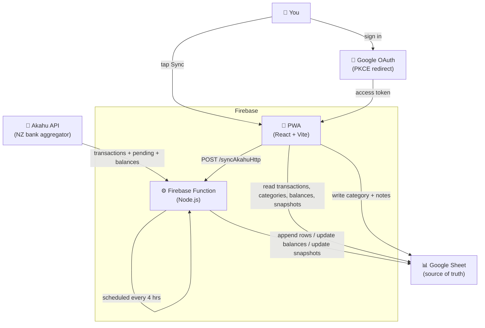

# Budget App

A personal budget app for tracking and categorising NZ bank transactions. Bank data is synced from [Akahu](https://akahu.nz) into a Google Sheet, which acts as the database. A PWA provides a mobile-friendly UI for viewing and categorising transactions.

## Architecture



### Data flow

| Path | How |
|---|---|
| Scheduled sync | Cloud Scheduler triggers `syncAkahu` every 4 hours (NZ time) |
| Manual sync | "Sync" button in the PWA calls `syncAkahuHttp` (auth'd with `SYNC_SECRET`) |
| Read data | PWA calls Google Sheets API v4 directly using the user's OAuth token |
| Write category | PWA writes back to the `transactions` sheet in-place |

## Sheets structure

### `transactions`
| `id` | `date` | `description` | `amount` | `account` | `category` | `notes` |

Pending (unprocessed) transactions are stored with a `pending_` ID prefix and `[PENDING]` description prefix. Replaced each sync. When a transaction settles, its category is carried over by matching on `amount + account`.

### `balances`
| `account` | `description` | `balance` | `last_transaction` |

Cleared and rewritten each sync. For ANZ-connection accounts, `balance` includes that account's pending transaction total — ANZ reports its balance as posted-only, unlike other Akahu connections.

### `categories`
| `name` | `colour` | `budget` |

### `rules` (auto-categorisation)
| `pattern` | `category` |

Case-insensitive substring match on description. Applied to new transactions at sync time.

### `history`
| `month` | `category` | `amount` |

Written by the sync function. One row per month/category combination. Excludes the Darragh Personal account. Create this sheet manually before the first sync.

### `meta`
Cell `B1` — last sync date (`YYYY-MM-DD`). Sync looks back 3 days from this date to catch late-arriving transactions.

### `snapshots`
| `month` | `expected` | `actual` | `diff` |

One row per month. `expected` is set manually. `actual` and `diff` are written by the sync function using the live sum of all account balances. Past months are frozen.

## PWA tabs

| Tab | Description |
|---|---|
| **Transactions** | Scrollable list grouped by date. Uncategorised debits highlighted red. Tap to categorise. |
| **Summary** | Month's total spend + live total balance. Per-account balances with this-month spend. Category breakdown. Personal due tracker with per-person clear buttons. |
| **Budget** | Progress bars for categories with a budget set. |
| **Snapshot** | Monthly cash-on-hand targets vs actuals. Current month is live; past months show stored values. |
| **History** | Per-month spend breakdown by category across all time. |

## Project structure

```
BudgetAppV2/
├── functions/                  # Firebase Functions (Node.js 20 / TypeScript)
│   └── src/
│       ├── index.ts            # syncAkahu (scheduled) + syncAkahuHttp (HTTP)
│       ├── akahu.ts            # Akahu API client (paginated + pending)
│       ├── sheets.ts           # Google Sheets read/write helpers
│       └── categorise.ts       # Rule matching logic
│
├── src/                        # PWA (React + Vite)
│   ├── App.tsx                 # Root — auth, tabs, sync trigger
│   ├── types.ts                # Shared TypeScript types
│   ├── lib/
│   │   ├── auth.ts             # OAuth 2.0 PKCE redirect flow
│   │   └── sheets.ts           # Sheets API client
│   ├── hooks/
│   │   ├── useTransactions.ts
│   │   ├── useCategories.ts
│   │   ├── useBalances.ts
│   │   └── useSnapshots.ts
│   └── components/
│       ├── TransactionList.tsx
│       ├── TransactionRow.tsx
│       ├── CategoryPicker.tsx
│       ├── MonthlySummary.tsx
│       ├── BudgetProgress.tsx
│       └── SnapshotTab.tsx
│
├── .github/workflows/deploy.yml  # Deploy to Firebase on push to main
├── firebase.json
├── vite.config.ts
├── tailwind.config.ts
└── claude.md                   # Full project spec and ways of working
```

## Setup

### 1. Akahu

Register a personal app at [my.akahu.nz](https://my.akahu.nz), connect your bank accounts, and note your **app token** and **user token**.

### 2. Google Sheet

Create a spreadsheet with sheets: `transactions`, `balances`, `categories`, `rules`, `meta`, `snapshots`. Add headers as documented in [claude.md](claude.md). Put an initial date in `meta!B1`.

### 3. Firebase project

Create a project at [console.firebase.google.com](https://console.firebase.google.com) (Blaze plan required). Enable Hosting.

Share the sheet with the **Compute Engine default service account** (`PROJECT_NUMBER-compute@developer.gserviceaccount.com`) as Editor.

### 4. Google OAuth

In [Google Cloud Console](https://console.cloud.google.com):
- Enable the **Google Sheets API**
- APIs & Services → Credentials → **+ Create Credentials → OAuth client ID** (Web application)
- Authorised JavaScript origins: `http://localhost:5174` and `https://your-project.web.app`
- Authorised redirect URIs: `http://localhost:5174` and `https://your-project.web.app`

### 5. Secrets (Functions)

```bash
firebase functions:secrets:set AKAHU_APP_TOKEN
firebase functions:secrets:set AKAHU_USER_TOKEN
firebase functions:secrets:set GOOGLE_SHEET_ID
firebase functions:secrets:set SYNC_SECRET
```

### 6. Environment (PWA)

Create `.env.local` in the repo root:

```
VITE_GOOGLE_CLIENT_ID=<your OAuth client ID>
VITE_GOOGLE_CLIENT_SECRET=<your OAuth client secret>
VITE_SHEET_ID=<your spreadsheet ID>
VITE_SYNC_URL=<deployed syncAkahuHttp URL>
VITE_SYNC_SECRET=<same value as SYNC_SECRET above>
```

### 7. CI/CD

Run `firebase init hosting:github --project <your-project-id>` to create a service account and add it as a GitHub secret. Then add the five `VITE_*` secrets in GitHub → Settings → Secrets → Actions.

Push to `main` — GitHub Actions deploys everything.

## Development

```bash
npm run dev                   # PWA dev server at http://localhost:5174
firebase emulators:start      # local Functions emulator
cd functions && npm run build # type-check functions
```

## Design principles

- **Sheets as source of truth** — always inspectable and editable directly.
- **No backend for reads/writes** — PWA calls Sheets API directly with the user's own OAuth token.
- **Idempotent sync** — deduplication by Akahu transaction ID means re-runs are always safe.
- **Mobile-first** — touch-friendly, dark theme, safe-area aware.
- **Personal tool** — no multi-tenancy, no user management, keep it simple.
